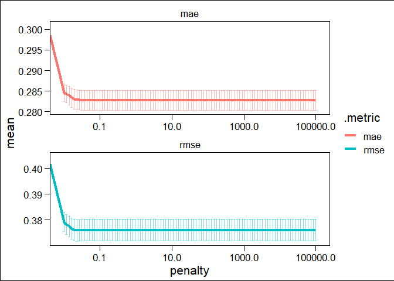

# Data

```{.r .fold-show}
# Loading email data set: consists of "text data" and "dummy variable"
email_df <- data.table::fread( "spam_or_not_spam.csv", header = T )
# Randomizing data
set.seed(46234)
email_df <- email_df[ sample( 1:nrow( email_df ) ),  ]
# Factoring dummy variable
email_df$label <- factor( email_df$label )
```

## Packages Used

```{.r .fold-show}
library(pacman)
p_load(fastverse, magrittr, here, skimr, dplyr, 
       ggplot2, ggthemes, equatiomatic, gridExtra, 
       caret, naivebayes, knitr, kableExtra, shiny, 
       data.table, tidymodels, ggthemes, wordcloud,
       tm, SnowballC, RColorBrewer, e1071, data.table, 
       stringr, disk.frame, knitr, ranger 
      )
```

## Preprocessing & Cleaning (stemming)
To retrieve the root of a word (eg, doing -> do), options are "stemming" &"lemmatization".

**STEMMING:** faster but maybe not as effective  
**LEMMATIZATION:** slower but more effective  
**More on this:** [Here](towardsdatascience.com/stemming-vs-lemmatization-2daddabcb221)

`VectorSource()`: creates one document for each email   
`Vcorpus()`:      creates a volatile corpus from these individual emails

```{.r .fold-show}
email_corpus <- VCorpus(
                  VectorSource(
                      email_df$email
                      )
                  )

# Using `tm` package to stem email content
email_corpus <- tm::tm_map( email_corpus, 
                            tm::stemDocument )

# Removing puctuations
email_corpus = tm_map( email_corpus, 
                       removePunctuation )

# Removing stopwords
email_corpus <- tm_map( email_corpus, 
                       removeWords, stopwords( "en" ) )

# OPTIONAL -- Removing two most frequent stopwords: "NUMBER", "URL"
 email_corpus <- tm_map( email_corpus,
 removeWords, c("NUMBER", "number", "url", "URL") )
 
# Testing keeping URL
 # email_corpus <- tm_map( email_corpus,
                        # removeWords, c("NUMBER", "number") )
 
# OPTIONAL -- Removing extra white space
# email_corpus <- tm_map( email_corpus,
#                         stringr::str_squish)
 
# DocumentTermMatrix(): tokenize the email corpus.
email_dtm <- tm::DocumentTermMatrix( sample( email_corpus, length( email_corpus ) ) )
```
                            

## Preprocessed Data for Visualization

```{.r .fold-show}
reverse_email <- data.frame(
                text = sapply( email_corpus, as.character ), 
                stringsAsFactors = FALSE, 
                type = email_df$label
                )
```
## Most Frequent Words in Data  
Visualing text data after cleaning and pre-processing

```r
wordcloud( reverse_email$text, 
           max.words = 150, 
           colors = brewer.pal( 7, "Dark2" ), 
           random.order = FALSE ) 
```

<!-- -->


## Subsetting spam vs. non-spam datasets 

### Visualizing most frequent words in spam data

```r
# Subsetting to spam == 1
spam <- reverse_email %>% filter( type == 1 )
wordcloud( spam$text, 
           max.words = 150, 
           colors = brewer.pal( 7, "Dark2" ), 
           random.order = FALSE,
           main = "Spam")
```

<!-- -->

### Visualing most frequent words in non-spam data

```r
# Subsetting to spam == 0
ham <- reverse_email %>% filter( type == 0 )
wordcloud( ham$text, 
           max.words = 150, 
           colors = brewer.pal( 7, "Dark2" ), 
           random.order = FALSE,
           main = "Non-Spam") 
```

<!-- -->

## Splitting Data

### Data is sorted randomly, so it's easy to split Testing vs. Training

```{.r .fold-show}
email_dtm_train <- email_dtm[   1:2400, ]         # 80% training
email_dtm_test  <- email_dtm[2401:3000, ]         # 20% testing

# Adding labels for convenience
email_train_label <- email_df[   1:2400, ]$label
email_test_label  <- email_df[2401:3000, ]$label
```

### Checking that data is split proportionally

```r
prop_table = data.frame(c(prop.table( table( email_train_label ) )[[2]], #Train
                          prop.table( table( email_train_label ) )[[1]]),
                        c(prop.table( table( email_test_label ) )[[2]], # Test
                          prop.table( table( email_test_label ) )[[1]])
                        )

rownames(prop_table) = c("Spam", "Non-Spam")
names(prop_table) = c("Train", "Test")
kable(prop_table, digits = 3) %>% 
  kable_styling(bootstrap_options = c("striped", "hover", "condensed", "responsive"))
```

<table class="table table-striped table-hover table-condensed table-responsive" style="margin-left: auto; margin-right: auto;">
 <thead>
  <tr>
   <th style="text-align:left;">   </th>
   <th style="text-align:right;"> Train </th>
   <th style="text-align:right;"> Test </th>
  </tr>
 </thead>
<tbody>
  <tr>
   <td style="text-align:left;"> Spam </td>
   <td style="text-align:right;"> 0.17 </td>
   <td style="text-align:right;"> 0.152 </td>
  </tr>
  <tr>
   <td style="text-align:left;"> Non-Spam </td>
   <td style="text-align:right;"> 0.83 </td>
   <td style="text-align:right;"> 0.848 </td>
  </tr>
</tbody>
</table>

## Trimming: reducing number of features 
We currently have 25,050 variables (too many!)  
Defining threshold (eg. 1 == 1%)
Goal: Eliminate words that appear in __% of records in the training data

```{.r .fold-show}
min_freq <- round( email_dtm$nrow * ( ( threshold = 10.0 ) / 100 ),     # using 10%
               0 
              )
```

## Create vector of most frequent words

```{.r .fold-show}
freq_words <- findFreqTerms( x = email_dtm, 
                             lowfreq = min_freq )

# Filter the DTM
email_dtm_freq_train <- email_dtm_train[ , freq_words]
email_dtm_freq_test  <- email_dtm_test[ , freq_words]
```


## Final, cleaned, prepared dataset

```{.r .fold-show}
# Simple dummy transformation fn.
convert_values <- function(x){
                    x = ifelse( x > 0, "Yes", "No" )
}

# Declaring final `train` and `test` datasets
email_train <- apply( email_dtm_freq_train, MARGIN = 2,
                      convert_values )
email_test  <- apply( email_dtm_freq_test, MARGIN = 2,
                      convert_values )

# Preview data
glimpse(email_train)
```

```
##  chr [1:2400, 1:207] "Yes" "No" "No" "No" "No" "No" "No" "No" "Yes" "No" ...
##  - attr(*, "dimnames")=List of 2
##   ..$ Docs : chr [1:2400] "2396" "2073" "2579" "2256" ...
##   ..$ Terms: chr [1:207] "actual" "address" "also" "american" ...
```


# Methods

```r
# I got all of this code from stackoverflow by doing some simple googling for how to display a confusion matrix
## Source https://stackoverflow.com/questions/23891140/r-how-to-visualize-confusion-matrix-using-the-caret-package

draw_confusion_matrix <- function(cm) {
  total <- sum(cm$table)
  res <- as.numeric(cm$table)
  # Generate color gradients. Palettes come from RColorBrewer.
  greenPalette <- c("#F7FCF5","#E5F5E0","#C7E9C0","#A1D99B","#74C476","#41AB5D","#238B45","#006D2C","#00441B")
  redPalette <- c("#FFF5F0","#FEE0D2","#FCBBA1","#FC9272","#FB6A4A","#EF3B2C","#CB181D","#A50F15","#67000D")
  getColor <- function (greenOrRed = "green", amount = 0) {
    if (amount == 0)
      return("#FFFFFF")
    palette <- greenPalette
    if (greenOrRed == "red")
      palette <- redPalette
    colorRampPalette(palette)(100)[10 + ceiling(90 * amount / total)]
  }
  # set the basic layout
  layout(matrix(c(1,1,2)))
  par(mar=c(2,2,2,2))
  plot(c(100, 345), c(300, 450), type = "n", xlab="", ylab="", xaxt='n', yaxt='n')
  title('Confusion Matrix', cex.main=2)
  # create the matrix 
  classes = colnames(cm$table)
  rect(150, 430, 240, 370, col=getColor("green", res[1]))
  text(195, 435, "Non-Spam", cex=1.2)
  rect(250, 430, 340, 370, col=getColor("red", res[3]))
  text(295, 435, "Spam", cex=1.2)
  text(125, 370, 'Predicted', cex=1.3, srt=90, font=2)
  text(245, 450, 'Actual', cex=1.3, font=2)
  rect(150, 305, 240, 365, col=getColor("red", res[2]))
  rect(250, 305, 340, 365, col=getColor("green", res[4]))
  text(140, 400, "Non-Spam", cex=1.2, srt=90)
  text(140, 335, "Spam", cex=1.2, srt=90)
  # add in the cm results
  text(195, 400, res[1], cex=1.6, font=2, col='black')
  text(195, 335, res[2], cex=1.6, font=2, col='black')
  text(295, 400, res[3], cex=1.6, font=2, col='black')
  text(295, 335, res[4], cex=1.6, font=2, col='black')
  # add in the specifics 
  plot(c(100, 0), c(100, 0), type = "n", xlab="", ylab="", main = "Metrics", xaxt='n', yaxt='n')
  text(10, 85, names(cm$byClass[1]), cex=1.2, font=2)
  text(10, 70, round(as.numeric(cm$byClass[1]), 3), cex=1.2)
  text(30, 85, names(cm$byClass[2]), cex=1.2, font=2)
  text(30, 70, round(as.numeric(cm$byClass[2]), 3), cex=1.2)
  text(50, 85, names(cm$byClass[5]), cex=1.2, font=2)
  text(50, 70, round(as.numeric(cm$byClass[5]), 3), cex=1.2)
  text(70, 85, names(cm$byClass[6]), cex=1.2, font=2)
  text(70, 70, round(as.numeric(cm$byClass[6]), 3), cex=1.2)
  text(90, 85, names(cm$byClass[7]), cex=1.2, font=2)
  text(90, 70, round(as.numeric(cm$byClass[7]), 3), cex=1.2)
  # add in the accuracy information 
  text(30, 35, names(cm$overall[1]), cex=1.5, font=2)
  text(30, 20, round(as.numeric(cm$overall[1]), 3), cex=1.4)
  text(70, 35, names(cm$overall[2]), cex=1.5, font=2)
  text(70, 20, round(as.numeric(cm$overall[2]), 3), cex=1.4)
} 
```


## Naive Bayes

```{.r .fold-show}
#Create model from the training dataset
bayes_classifier <- e1071::naiveBayes( email_train, 
                                       email_train_label )

# Predicting on test data
email_test_pred <- predict( bayes_classifier, 
                            email_test )
```


### Naive Bayes Results

```{.r .fold-show}
# Display results
naive_bayes_results = confusionMatrix( data = email_test_pred, 
                                       reference = email_test_label,
                                       positive = "1", 
                                       dnn = c("Prediction", "Actual") )

draw_confusion_matrix(naive_bayes_results)
```

<!-- -->

## Lasso

```{.r .fold-show}
# Removing scientific notation
options(scipen = 99999)

# Adding spam vs ham to train data
email_train <- cbind( email_train, 
                      email_train_label )
# Adding spam vs ham to train data
email_test <- cbind( email_test, 
                      email_test_label )
 
# Save and reload datasets
write.csv(email_train, "test.csv")
email_train <- fread("test.csv") %>% data.frame()

write.csv(email_test, "test2.csv")
email_test <- fread("test2.csv") %>% data.frame()

# 0 and 1 for dummy instead of 1 and 2
email_train$email_train_label <- ifelse(email_train$email_train_label == 1, 0, 1)
email_test$email_test_label <- ifelse(email_test$email_test_label == 1, 0, 1)
```


```r
# Splitting for 5-fold cross-validation
folds <- email_train %>% vfold_cv(v = 5)

# Defining Lambdas (from Lecture 005)
lambdas <- data.frame( penalty = c( 0, 10^seq( from = 5, to = -2, length = 100 ) ) )

# Defining the recipe
data_recipe <- recipe(
                email_train_label ~ ., 
                data = email_train 
                ) %>% 
              update_role(V1, new_role = 'id variable')  %>% 
              step_dummy(all_nominal(), - all_outcomes())

# Defining Lasso Model
lasso <- linear_reg(
          penalty = tune(), 
          mixture = 1) %>% 
          set_engine("glmnet")

# Setting up workflow
workflow_lasso <- workflow() %>%
                    add_recipe( data_recipe ) %>%
                    add_model( lasso )
# Parallelize 
doParallel::registerDoParallel(cores = 4)

# CV
lasso_cv <- workflow_lasso %>% 
              tune_grid(
                resamples = folds,
                grid = lambdas,
                metrics = metric_set(rmse, mae)
              )
```

### Lasso Results

```r
# Find best models            ( source: juliasilge.com/blog/lasso-the-office/ )
lasso_cv %>% collect_metrics() %>%
            ggplot(aes(penalty, mean, color = .metric)) +
            geom_errorbar(aes(
              ymin = mean - std_err,
              ymax = mean + std_err
            ),
            alpha = 0.5
            ) +
            geom_line(size = 1.5) +
            facet_wrap(~.metric, scales = "free", nrow = 2) +
            theme(legend.position = "none") + theme_base() + 
            # xlim(0, 1000) +
            scale_x_log10()
```

<!-- -->

```r
best_lasso_mae = lasso_cv %>% show_best(metric = "mae") %>% filter(penalty == min(penalty))
best_lasso_rmse = lasso_cv %>% show_best(metric = "rmse") %>% filter(penalty == min(penalty))
best_lasso = rbind(best_lasso_mae, best_lasso_rmse)
names(best_lasso) = c("Penalty", "Metric", "Estimator", "Mean", "n", "Standard Error", ".config")
kable(best_lasso, digits = 3) %>% 
  kable_styling(bootstrap_options = c("striped", "hover", "condensed", "responsive"))
```

<table class="table table-striped table-hover table-condensed table-responsive" style="margin-left: auto; margin-right: auto;">
 <thead>
  <tr>
   <th style="text-align:right;"> Penalty </th>
   <th style="text-align:left;"> Metric </th>
   <th style="text-align:left;"> Estimator </th>
   <th style="text-align:right;"> Mean </th>
   <th style="text-align:right;"> n </th>
   <th style="text-align:right;"> Standard Error </th>
   <th style="text-align:left;"> .config </th>
  </tr>
 </thead>
<tbody>
  <tr>
   <td style="text-align:right;"> 0.031 </td>
   <td style="text-align:left;"> mae </td>
   <td style="text-align:left;"> standard </td>
   <td style="text-align:right;"> 0.283 </td>
   <td style="text-align:right;"> 5 </td>
   <td style="text-align:right;"> 0.002 </td>
   <td style="text-align:left;"> Preprocessor1_Model009 </td>
  </tr>
  <tr>
   <td style="text-align:right;"> 0.023 </td>
   <td style="text-align:left;"> rmse </td>
   <td style="text-align:left;"> standard </td>
   <td style="text-align:right;"> 0.376 </td>
   <td style="text-align:right;"> 5 </td>
   <td style="text-align:right;"> 0.004 </td>
   <td style="text-align:left;"> Preprocessor1_Model007 </td>
  </tr>
</tbody>
</table>


```r
# Get test accuracy
best_lasso_workflow = workflow_lasso %>%
  finalize_workflow(select_best(lasso_cv, metric = "mae")) %>%
  fit(data = email_train)

best_lasso = best_lasso_workflow %>% extract_fit_parsnip()

## Clean test data
email_test_clean = recipe(
                email_test_label ~ ., 
                data = email_test 
                ) %>% 
              update_role(V1, new_role = 'id variable')  %>% 
              step_dummy(all_nominal(), - all_outcomes()) %>%
              prep() %>% juice()

## Make predictions
lasso_predictions = predict(best_lasso, email_test_clean)
lasso_predictions = lasso_predictions %>% mutate(prediction = ifelse(.pred < 0.5, 0, 1))
email_test_clean$predictions = lasso_predictions$prediction

## Calculate accuracy
email_test_clean = email_test_clean %>% mutate(accurate = ifelse(predictions == email_test_label, 1, 0))
acc = sum(email_test_clean$accurate) / nrow(email_test_clean)
# print(acc)
```


## Logistic Lasso

```{.r .fold-show}
# Set seed
set.seed(9753)
# converting outcome variable into character vector
email_train <- email_train %>% 
                  mutate(
                    outcome_as_vector = ifelse(email_train_label == 1, "Yes", "No")
                  ) 
# Split for 5-fold cross-validation
folds <- vfold_cv(email_train, v = 5)
# Defining the recipe
data_recipe <- recipe(
                  outcome_as_vector ~ ., 
                  data = email_train 
                ) %>% 
                  step_rm(email_train_label) %>% 
                  update_role(V1, new_role = 'id variable') %>%
                  # step_num2factor( email_train_label ) %>% 
                  step_dummy(all_nominal(), - all_outcomes()) %>%
                  step_zv(all_predictors()) %>%
                  step_normalize(all_predictors())
# Defining Lambdas (from Lecture 005)
lambdas <- data.frame( penalty = c( 0, 10^seq( from = 5, to = -2, length = 100 ) ) )
# Defining Lasso Model
log_lasso <- logistic_reg(
            mode = 'classification',
            penalty = tune(), 
            mixture = 1) %>% 
            set_engine("glmnet")
# Setting up workflow
workflow_lasso <- workflow() %>%
                    add_recipe( data_recipe ) %>%
                    add_model( log_lasso )
# Parallelize 
# doParallel::registerDoParallel(cores = 4)
# CV
log_lasso_cv <- workflow_lasso %>% 
                tune_grid(
                  resamples = folds,
                  metrics = metric_set(accuracy, roc_auc, sens, spec, precision),
                  grid = grid_latin_hypercube(penalty(), size = 5),
                  # grid = grid_latin_hypercube(penalty() , mixture(), size = 20),
                  control = control_grid(parallel_over = 'resamples')
                )
```

### Logistic Lasso Results

```r
# Find best models            ( source: juliasilge.com/blog/lasso-the-office/ )
# log_lasso_cv %>% collect_metrics() %>% arrange(mean) %>%
#                 ggplot(aes(penalty, mean, color = .metric)) +
#                 # geom_line(size = 1.5) +
#                 # geom_errorbar(aes(
#                 #   ymin = mean - std_err,
#                 #   ymax = mean + std_err
#                 # ),
#                 # alpha = 0.5
#                 # ) +
#                 geom_smooth(aes(penalty, mean, color = .metric)
#                             , size = 1 
#                             , alpha = 0.5
#                             , method = "lm") +
#                 # facet_wrap(~.metric, scales = "free", nrow = 3) +
#                 # scale_x_log10() +
#                 # scale_y_log10() +
#                 theme(legend.position = "none") + theme_base() #+ xlim(0, 0.1)
log_lasso_cv_results = log_lasso_cv %>% collect_metrics() %>% group_by(.metric) %>% summarize(mean_accuracy = mean(mean, na.rm = T))
log_lasso_cv_results[1] = c("Accuracy", 
                       "Precision", 
                       "Area Under the Curve", 
                       "Sensitivity", 
                       "Specificity")
names(log_lasso_cv_results) = c("Metric", "Mean")
kable(log_lasso_cv_results, digits = 3) %>% 
kable_styling(bootstrap_options = c("striped", "hover", "condensed", "responsive"))
```

<table class="table table-striped table-hover table-condensed table-responsive" style="margin-left: auto; margin-right: auto;">
 <thead>
  <tr>
   <th style="text-align:left;"> Metric </th>
   <th style="text-align:right;"> Mean </th>
  </tr>
 </thead>
<tbody>
  <tr>
   <td style="text-align:left;"> Accuracy </td>
   <td style="text-align:right;"> 0.809 </td>
  </tr>
  <tr>
   <td style="text-align:left;"> Precision </td>
   <td style="text-align:right;"> 0.831 </td>
  </tr>
  <tr>
   <td style="text-align:left;"> Area Under the Curve </td>
   <td style="text-align:right;"> 0.508 </td>
  </tr>
  <tr>
   <td style="text-align:left;"> Sensitivity </td>
   <td style="text-align:right;"> 0.967 </td>
  </tr>
  <tr>
   <td style="text-align:left;"> Specificity </td>
   <td style="text-align:right;"> 0.040 </td>
  </tr>
</tbody>
</table>


## Logistic 

```{.r .fold-show}
# set.seed(9754)
set.seed(9753)
# converting outcome variable into character vector
email_train <- email_train %>% 
                        mutate(
                          outcome_as_vector = ifelse(email_train_label == 1, "Yes", "No")
                        ) 
# Split for 5-fold cross-validation
folds <- vfold_cv(email_train, v = 5)
# small sample of data 
# sample <- email_train[, ]
# Defining the recipe
data_recipe <- recipe(
                  outcome_as_vector ~ ., 
                  data = email_train 
                    ) %>% 
                  step_rm(email_train_label) %>% 
                  update_role(V1, new_role = 'id variable') %>%
                  # step_num2factor( email_train_label ) %>% 
                  step_dummy(all_nominal(), - all_outcomes()) %>%
                  step_zv(all_predictors()) %>%
                  step_normalize(all_predictors())
# Define the model
model_logistic <- logistic_reg(
                    mode = 'classification') %>%    # Simple LogReg bc no penalty
                    set_engine('glm')
# Workflow
workflow_logistic <- workflow() %>% 
                      add_recipe(data_recipe) %>% 
                      add_model(model_logistic)
# Cross-Validation
cv_logistic <- workflow_logistic %>%
                fit_resamples(
                  resamples = folds,
                  metrics = metric_set(accuracy, roc_auc, sens, spec, precision)
                )
```

### Logistic Regression Results

```r
# Visualizing output
log_reg_results = cv_logistic %>% collect_metrics() %>% 
      select(.metric, mean)
log_reg_results[1] = c("Accuracy", 
                       "Precision", 
                       "Area Under the Curve", 
                       "Sensitivity", 
                       "Specificity")
names(log_reg_results) = c("Metric", "Mean")
kable(log_reg_results, digits = 3) %>% 
  kable_styling(bootstrap_options = c("striped", "hover", "condensed", "responsive"))
```

<table class="table table-striped table-hover table-condensed table-responsive" style="margin-left: auto; margin-right: auto;">
 <thead>
  <tr>
   <th style="text-align:left;"> Metric </th>
   <th style="text-align:right;"> Mean </th>
  </tr>
 </thead>
<tbody>
  <tr>
   <td style="text-align:left;"> Accuracy </td>
   <td style="text-align:right;"> 0.797 </td>
  </tr>
  <tr>
   <td style="text-align:left;"> Precision </td>
   <td style="text-align:right;"> 0.832 </td>
  </tr>
  <tr>
   <td style="text-align:left;"> Area Under the Curve </td>
   <td style="text-align:right;"> 0.511 </td>
  </tr>
  <tr>
   <td style="text-align:left;"> Sensitivity </td>
   <td style="text-align:right;"> 0.947 </td>
  </tr>
  <tr>
   <td style="text-align:left;"> Specificity </td>
   <td style="text-align:right;"> 0.071 </td>
  </tr>
</tbody>
</table>

## Random Forests

```{.r .fold-show}
random_forest <- train(
                  x = email_train_rf,
                  y = email_train_label_rf,
                  method = "ranger", 
                  num.trees = 200,
                  importance = "impurity",
                  trControl = trainControl(method = "cv", 
                                           number = 3,
                                           verboseIter = TRUE
                  )
                )
```

```
## Aggregating results
## Selecting tuning parameters
## Fitting mtry = 2, splitrule = gini, min.node.size = 1 on full training set
```
### Random Forests Results

```r
# Checking "variable importances 
top_25words = varImp(random_forest, scale = TRUE)$importance %>% 
                rownames_to_column() %>% 
                arrange(-Overall) %>% 
                top_n(25) 
```

```
## Selecting by Overall
```

```r
# ggplot(data = top_25words) + 
# aes(x = reorder(rowname, Overall), y = Overall) +
# geom_col(stat = "identify") + 
# labs(title = "Most Predictive Words") +
# coord_flip()

ggplot(data = top_25words, 
   aes(x=reorder(rowname, Overall),
       y = Overall)) +
        geom_bar(stat = "identity") +
        theme_base() +
        theme(axis.text.x=element_text(angle=50, hjust=1))+
        xlab("Top 25 Predictive Words(stemed)")+
        ylab("Frequency of Word") +
        labs(title = "Most Predictive Words") +
        theme(plot.title = element_text(hjust = 0.5))
```

<!-- -->

```r
# Redeclaring `email_test`
email_test  <- apply( email_dtm_freq_test, MARGIN = 2,
                      convert_values )
email_test <- cbind( email_test, 
                     email_test_label )

# Fitting to the test data
predictions <- predict(random_forest, email_test)
random_forest_results = confusionMatrix(predictions, email_test_label)
draw_confusion_matrix(random_forest_results)
```

<!-- -->

# Results

```r
# Creating df with different metrics and results
comparing_acc_table = data.frame(
  
  c(
    "Naive Bayes",
    "Lasso",
    "Logistic Lasso",
    "Logistic",
    "Random Forest"
    ),
  
  c(
    naive_bayes_results[["overall"]][["Accuracy"]],
    acc,
    log_lasso_cv_results$Mean[1],
    log_reg_results$Mean[1],
    random_forest_results[["overall"]][["Accuracy"]]
    ),
  
  c(
    naive_bayes_results[["byClass"]][["Sensitivity"]],
    0,
    log_lasso_cv_results$Mean[4],
    log_reg_results$Mean[4],
    random_forest_results[["byClass"]][["Sensitivity"]]
  ),
  
  c(
    naive_bayes_results[["byClass"]][["Specificity"]],
    1,
    log_lasso_cv_results$Mean[5],
    log_reg_results$Mean[5],
    random_forest_results[["byClass"]][["Specificity"]]
  )
  
)

names(comparing_acc_table) = c("Method", "Accuracy", "Sensitivity", "Specificity")
kable(comparing_acc_table, digits = 3) %>% 
  kable_styling(bootstrap_options = c("striped", "hover", "condensed", "responsive"))
```

<table class="table table-striped table-hover table-condensed table-responsive" style="margin-left: auto; margin-right: auto;">
 <thead>
  <tr>
   <th style="text-align:left;"> Method </th>
   <th style="text-align:right;"> Accuracy </th>
   <th style="text-align:right;"> Sensitivity </th>
   <th style="text-align:right;"> Specificity </th>
  </tr>
 </thead>
<tbody>
  <tr>
   <td style="text-align:left;"> Naive Bayes </td>
   <td style="text-align:right;"> 0.788 </td>
   <td style="text-align:right;"> 0.044 </td>
   <td style="text-align:right;"> 0.921 </td>
  </tr>
  <tr>
   <td style="text-align:left;"> Lasso </td>
   <td style="text-align:right;"> 0.848 </td>
   <td style="text-align:right;"> 0.000 </td>
   <td style="text-align:right;"> 1.000 </td>
  </tr>
  <tr>
   <td style="text-align:left;"> Logistic Lasso </td>
   <td style="text-align:right;"> 0.809 </td>
   <td style="text-align:right;"> 0.967 </td>
   <td style="text-align:right;"> 0.040 </td>
  </tr>
  <tr>
   <td style="text-align:left;"> Logistic </td>
   <td style="text-align:right;"> 0.797 </td>
   <td style="text-align:right;"> 0.947 </td>
   <td style="text-align:right;"> 0.071 </td>
  </tr>
  <tr>
   <td style="text-align:left;"> Random Forest </td>
   <td style="text-align:right;"> 0.847 </td>
   <td style="text-align:right;"> 0.998 </td>
   <td style="text-align:right;"> 0.000 </td>
  </tr>
</tbody>
</table>

Methods
Naive Bayes
Lasso
Logistic Lasso
Logistic
Random Forest

Accuracy
