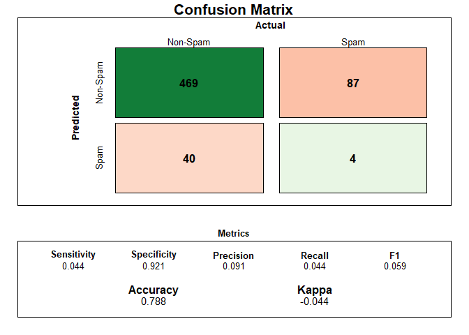
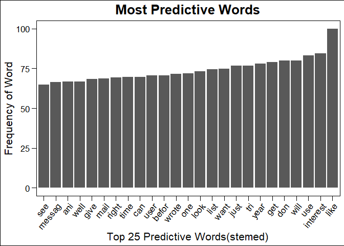

These are just some notes for me...  
# TODO:
- Change up axis on log_lasso plot  
- Add more color to Confusion Matrix 
- Confirm we want to keep our seed the same for logreg
- Random Forrest CM
- Random Name Generator


# Introduction
@Zoe


# Data
@Zoe  


## Loading Data

```r
# Loading email dataset: consists of "text data" and "dummy variable"
email_df <- data.table::fread( "spam_or_not_spam.csv", header = T )

# Randomizing data
set.seed(46234)
email_df <- email_df[ sample( 1:nrow( email_df ) ),  ]

# Factoring dummy variable
email_df$label <- factor( email_df$label )
```

## Loading Packages

```r
library(pacman)
p_load(fastverse, magrittr, here, skimr, dplyr, 
       ggplot2, ggthemes, equatiomatic, gridExtra, 
       caret, naivebayes, knitr, kableExtra, shiny, 
       data.table, tidymodels, ggthemes, wordcloud,
       tm, SnowballC, RColorBrewer, e1071, data.table, 
       stringr, disk.frame, knitr, ranger #, randomForest
       )
```

## Preprocessing & Cleaning (stemming)
To retrieve the root of a word (eg, doing -> do), options are "stemming" &
"lemmatization".

**STEMMING:** faster but maybe not as effective  
**LEMMATIZATION:** slower but more effective  
**More on this:** [Here](towardsdatascience.com/stemming-vs-lemmatization-2daddabcb221)

`VectorSource()`: creates one document for each email   
`Vcorpus()`:      creates a volatile corpus from these individual emails

```r
email_corpus <- VCorpus(
                  VectorSource(
                      email_df$email
                      )
                  )
# Using `tm` package to stem email content
email_corpus <- tm::tm_map( email_corpus, 
                            tm::stemDocument )

# Removing puctuations
email_corpus = tm_map( email_corpus, 
                       removePunctuation )

# Removing stopwords
email_corpus <- tm_map( email_corpus, 
                       removeWords, stopwords( "en" ) )

# OPTIONAL -- Removing two most frequent stopwords: "NUMBER", "URL"
email_corpus <- tm_map( email_corpus,
                       removeWords, c("NUMBER", "number", "url", "URL") )

# OPTIONAL -- Removing extra white space
# email_corpus <- tm_map( email_corpus,
#                         stringr::str_squish)

# DocumentTermMatrix(): tokenize the email corpus.
email_dtm <- tm::DocumentTermMatrix( sample( email_corpus, length( email_corpus ) ) )
```
                            

## Preprocessed Data for Visualization

```r
reverse_email <- data.frame(
                text = sapply( email_corpus, as.character ), 
                stringsAsFactors = FALSE, 
                type = email_df$label
                )
```
## Most Frequent Words in Data  
Visualing text data after cleaning and pre-processing

```r
wordcloud( reverse_email$text, 
           max.words = 150, 
           colors = brewer.pal( 7, "Dark2" ), 
           random.order = FALSE ) 
```

<!-- -->


## Subsetting spam vs. non-spam datasets 

### Visualizing most frequent words in spam data

```r
# Subsetting to spam == 1
spam <- reverse_email %>% filter( type == 1 )
wordcloud( spam$text, 
           max.words = 150, 
           colors = brewer.pal( 7, "Dark2" ), 
           random.order = FALSE,
           main = "Spam")
```

<!-- -->

### Visualing most frequent words in non-spam data

```r
# Subsetting to spam == 0
ham <- reverse_email %>% filter( type == 0 )
wordcloud( ham$text, 
           max.words = 150, 
           colors = brewer.pal( 7, "Dark2" ), 
           random.order = FALSE,
           main = "Non-Spam") 
```

<!-- -->

## Splitting Data

### Data is sorted randomly, so it's easy to split Testing vs. Training

```r
email_dtm_train <- email_dtm[   1:2400, ]         # 80% training
email_dtm_test  <- email_dtm[2400:3000, ]         # 20% testing
# Adding labels for convenience
email_train_label <- email_df[   1:2400, ]$label
email_test_label  <- email_df[2400:3000, ]$label
```

### Checking that data is split proportionally

```r
prop_table = data.frame(c(prop.table( table( email_train_label ) )[[2]], #Train
                          prop.table( table( email_train_label ) )[[1]]),
                        c(prop.table( table( email_test_label ) )[[2]], # Test
                          prop.table( table( email_test_label ) )[[1]])
                        )
rownames(prop_table) = c("Spam", "Non-Spam")
names(prop_table) = c("Train", "Test")
kable(prop_table, digits = 3) %>% 
  kable_styling(bootstrap_options = c("striped", "hover", "condensed", "responsive"))
```

<table class="table table-striped table-hover table-condensed table-responsive" style="margin-left: auto; margin-right: auto;">
 <thead>
  <tr>
   <th style="text-align:left;">   </th>
   <th style="text-align:right;"> Train </th>
   <th style="text-align:right;"> Test </th>
  </tr>
 </thead>
<tbody>
  <tr>
   <td style="text-align:left;"> Spam </td>
   <td style="text-align:right;"> 0.17 </td>
   <td style="text-align:right;"> 0.151 </td>
  </tr>
  <tr>
   <td style="text-align:left;"> Non-Spam </td>
   <td style="text-align:right;"> 0.83 </td>
   <td style="text-align:right;"> 0.849 </td>
  </tr>
</tbody>
</table>

## Trimming: reducing number of features 
We currently 25,050 variables (too many!)  
Defining threshold (eg. 1 == 1%)
Goal: Eliminate words that appear in __% of records in the training data

```r
min_freq <- round( 
                email_dtm$nrow * ( ( threshold = 10.0 ) / 100 ),     # using 10%
                0 
              ) 
```

## Create vector of most frequent words

```r
freq_words <- findFreqTerms( x = email_dtm, 
                             lowfreq = min_freq )
# Filter the DTM
email_dtm_freq_train <- email_dtm_train[ , freq_words]
email_dtm_freq_test  <- email_dtm_test[ , freq_words]
```


## Final, cleaned, prepared dataset

```r
# Simple dummy transformation fn.
convert_values <- function(x){
                    x = ifelse( x > 0, "Yes", "No" )
                  }

# Declaring final `train` and `test` datasets
email_train <- apply( email_dtm_freq_train, MARGIN = 2,
                      convert_values )

email_test  <- apply( email_dtm_freq_test, MARGIN = 2,
                      convert_values )
glimpse(email_train)
```

```
##  chr [1:2400, 1:207] "Yes" "No" "No" "No" "No" "No" "No" "No" "Yes" "No" ...
##  - attr(*, "dimnames")=List of 2
##   ..$ Docs : chr [1:2400] "2396" "2073" "2579" "2256" ...
##   ..$ Terms: chr [1:207] "actual" "address" "also" "american" ...
```


# Methods


## Naive Bayes

```r
#Create model from the training dataset
bayes_classifier <- e1071::naiveBayes( email_train, 
                                       email_train_label )
# Predicting on test data
email_test_pred <- predict( bayes_classifier, 
                            email_test )
```


### Naive Bayes Results
<!-- -->

## Lasso


```r
# Splitting for 5-fold cross-validation
folds <- email_train %>% vfold_cv(v = 5)

# Defining Lambdas (from Lecture 005)
lambdas <- data.frame( penalty = c( 0, 10^seq( from = 5, to = -2, length = 100 ) ) )

# Defining the recipe
data_recipe <- recipe(
                email_train_label ~ ., 
                data = email_train 
                ) %>% 
              update_role(V1, new_role = 'id variable')  %>% 
              step_dummy(all_nominal(), - all_outcomes()) %>%
              step_zv(all_predictors()) %>%
              step_normalize(all_predictors())

# Defining Lasso Model
lasso <- linear_reg(
          penalty = tune(), 
          mixture = 1) %>% 
          set_engine("glmnet")

# Setting up workflow
workflow_lasso <- workflow() %>%
                    add_recipe( data_recipe ) %>%
                    add_model( lasso )

# Parallelize 
doParallel::registerDoParallel(cores = 4)

# CV
lasso_cv <- workflow_lasso %>% 
              tune_grid(
                resamples = folds,
                grid = lambdas,
                metrics = metric_set(rmse, mae)
              )
```

### Lasso Results

```
## Warning: Transformation introduced infinite values in continuous x-axis

## Warning: Transformation introduced infinite values in continuous x-axis
```

<!-- --><table class="table table-striped table-hover table-condensed table-responsive" style="margin-left: auto; margin-right: auto;">
 <thead>
  <tr>
   <th style="text-align:left;"> Metric </th>
   <th style="text-align:right;"> Mean Accuracy </th>
  </tr>
 </thead>
<tbody>
  <tr>
   <td style="text-align:left;"> Mean Absolute Error </td>
   <td style="text-align:right;"> 0.278 </td>
  </tr>
  <tr>
   <td style="text-align:left;"> Root Mean Squared Error </td>
   <td style="text-align:right;"> 0.373 </td>
  </tr>
</tbody>
</table>


## Logistic Lasso

```r
# Set seed
set.seed(9753)

# converting outcome variable into character vector
email_train <- email_train %>% 
                  mutate(
                    outcome_as_vector = ifelse(email_train_label == 1, "Yes", "No")
                  ) 

# Split for 5-fold cross-validation
folds <- vfold_cv(email_train, v = 5)

# Defining the recipe
data_recipe <- recipe(
                  outcome_as_vector ~ ., 
                  data = email_train 
                ) %>% 
                  step_rm(email_train_label) %>% 
                  update_role(V1, new_role = 'id variable') %>%
                  # step_num2factor( email_train_label ) %>% 
                  step_dummy(all_nominal(), - all_outcomes()) %>%
                  step_zv(all_predictors()) %>%
                  step_normalize(all_predictors())

# Defining Lambdas (from Lecture 005)
lambdas <- data.frame( penalty = c( 0, 10^seq( from = 5, to = -2, length = 100 ) ) )

# Defining Lasso Model
log_lasso <- logistic_reg(
            mode = 'classification',
            penalty = tune(), 
            mixture = 1) %>% 
            set_engine("glmnet")

# Setting up workflow
workflow_lasso <- workflow() %>%
                    add_recipe( data_recipe ) %>%
                    add_model( log_lasso )

# Parallelize 
# doParallel::registerDoParallel(cores = 4)

# CV
log_lasso_cv <- workflow_lasso %>% 
                tune_grid(
                  resamples = folds,
                  metrics = metric_set(accuracy, roc_auc, sens, spec, precision),
                  grid = grid_latin_hypercube(penalty(), size = 5),
                  # grid = grid_latin_hypercube(penalty() , mixture(), size = 20),
                  control = control_grid(parallel_over = 'resamples')
                )
```

### Logistic Lasso Results
<table class="table table-striped table-hover table-condensed table-responsive" style="margin-left: auto; margin-right: auto;">
 <thead>
  <tr>
   <th style="text-align:left;"> Metric </th>
   <th style="text-align:right;"> Mean </th>
  </tr>
 </thead>
<tbody>
  <tr>
   <td style="text-align:left;"> Accuracy </td>
   <td style="text-align:right;"> 0.822 </td>
  </tr>
  <tr>
   <td style="text-align:left;"> Precision </td>
   <td style="text-align:right;"> 0.834 </td>
  </tr>
  <tr>
   <td style="text-align:left;"> Area Under the Curve </td>
   <td style="text-align:right;"> 0.501 </td>
  </tr>
  <tr>
   <td style="text-align:left;"> Sensitivity </td>
   <td style="text-align:right;"> 0.982 </td>
  </tr>
  <tr>
   <td style="text-align:left;"> Specificity </td>
   <td style="text-align:right;"> 0.022 </td>
  </tr>
</tbody>
</table>


## Logistic 

```r
# set.seed(9754)
set.seed(9753)


# converting outcome variable into character vector
email_train <- email_train %>% 
                        mutate(
                          outcome_as_vector = ifelse(email_train_label == 1, "Yes", "No")
                        ) 

# Split for 5-fold cross-validation
folds <- vfold_cv(email_train, v = 5)

# small sample of data 
# sample <- email_train[, ]

# Defining the recipe
data_recipe <- recipe(
                  outcome_as_vector ~ ., 
                  data = email_train 
                    ) %>% 
                  step_rm(email_train_label) %>% 
                  update_role(V1, new_role = 'id variable') %>%
                  # step_num2factor( email_train_label ) %>% 
                  step_dummy(all_nominal(), - all_outcomes()) %>%
                  step_zv(all_predictors()) %>%
                  step_normalize(all_predictors())


# Define the model
model_logistic <- logistic_reg(
                    mode = 'classification') %>%    # Simple LogReg bc no penalty
                    set_engine('glm')

# Workflow
workflow_logistic <- workflow() %>% 
                      add_recipe(data_recipe) %>% 
                      add_model(model_logistic)

# Cross-Validation
cv_logistic <- workflow_logistic %>%
                fit_resamples(
                  resamples = folds,
                  metrics = metric_set(accuracy, roc_auc, sens, spec, precision)
                )
```

### Logistic Regression Results
<table class="table table-striped table-hover table-condensed table-responsive" style="margin-left: auto; margin-right: auto;">
 <thead>
  <tr>
   <th style="text-align:left;"> Metric </th>
   <th style="text-align:right;"> Mean </th>
  </tr>
 </thead>
<tbody>
  <tr>
   <td style="text-align:left;"> Accuracy </td>
   <td style="text-align:right;"> 0.814 </td>
  </tr>
  <tr>
   <td style="text-align:left;"> Precision </td>
   <td style="text-align:right;"> 0.834 </td>
  </tr>
  <tr>
   <td style="text-align:left;"> Area Under the Curve </td>
   <td style="text-align:right;"> 0.500 </td>
  </tr>
  <tr>
   <td style="text-align:left;"> Sensitivity </td>
   <td style="text-align:right;"> 0.971 </td>
  </tr>
  <tr>
   <td style="text-align:left;"> Specificity </td>
   <td style="text-align:right;"> 0.030 </td>
  </tr>
</tbody>
</table>

## Random Forests

```r
random_forest <- train(
                  x = email_train_rf,
                  y = email_train_label_rf,
                  method = "ranger", 
                  num.trees = 200,
                  importance = "impurity",
                  trControl = trainControl(method = "cv", 
                                           number = 3,
                                           verboseIter = TRUE
                  )
                )
```

```
## Aggregating results
## Selecting tuning parameters
## Fitting mtry = 2, splitrule = gini, min.node.size = 1 on full training set
```
### Random Forests Results

```r
# Checking "variable importances 
top_25words = varImp(random_forest, scale = TRUE)$importance %>% 
                rownames_to_column() %>% 
                arrange(-Overall) %>% 
                top_n(25) 
```

```
## Selecting by Overall
```

```r
# ggplot(data = top_25words) + 
# aes(x = reorder(rowname, Overall), y = Overall) +
# geom_col(stat = "identify") + 
# labs(title = "Most Predictive Words") +
# coord_flip()

ggplot(data = top_25words, 
   aes(x=reorder(rowname, Overall),
       y = Overall)) +
        geom_bar(stat = "identity") +
        theme_base() +
        theme(axis.text.x=element_text(angle=50, hjust=1))+
        xlab("Top 25 Predictive Words(stemed)")+
        ylab("Frequency of Word") +
        labs(title = "Most Predictive Words") +
        theme(plot.title = element_text(hjust = 0.5))
```

<!-- -->

```r
# Fitting to the test data
predictions <- predict(random_forest, email_test)
random_forest_results = confusionMatrix(predictions, email_test_label)
draw_confusion_matrix(random_forest_results)
```

<!-- -->

# Results


