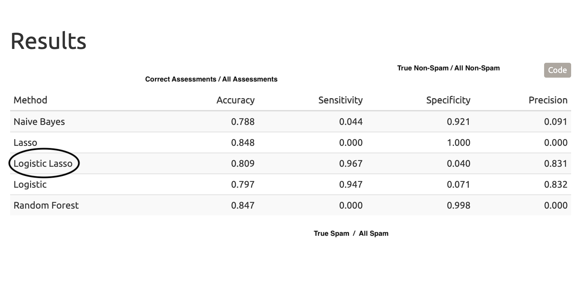

```{r setup, include=FALSE}
knitr::opts_chunk$set(echo = FALSE)
```

# Introduction
- Spam messages are annoying but also invasive

- An open spam email can transmit personal and computer information to a spammer, including:
  - your IP address
  - your location
  - your device type
  - your operating system
  - your place of work
  - and more...
  
- Email providers use machine algorithms to screen messages and protect their users, which is what we will be attempting to do

- **Research Question:** What type of model predicts spam emails using word frequencies the best?
 
---
 
# Data

 - We got data on [Kaggle](https://www.kaggle.com/venky73/spam-mails-dataset)
 - Text of 500 spam emails and 2,500 non-spam emails
 - Stemming (retrieving the root of a word)
 - Removing common stop words (such as “the” and “to”)
 
```{r, figures-side, fig.show="hold", out.width="50%", warning=FALSE}
library(knitr)
include_graphics(c("nonspam_wordcloud.jpeg", "spam_wordcloud.jpeg"))
```
---

#  Methods

 - Naive Bayes  
 - Lasso  
 - Logistic Lasso
 - Logistic
 - Random Forest
---

# Results
